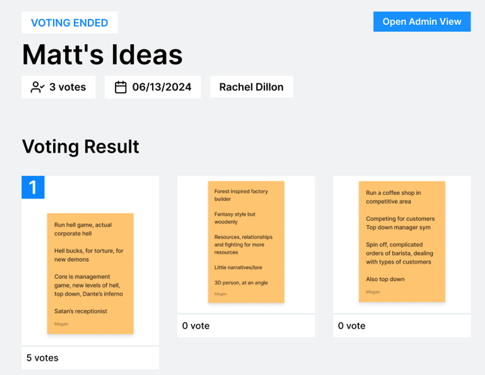
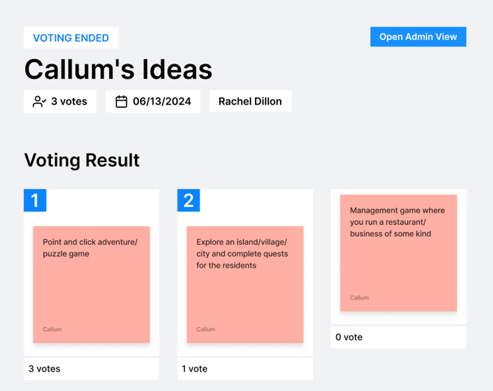

# 30/5 Week 1: Webinar

1. Assigned supervisor. 
2. Artefact = a thing. Game/app/website. 

Aim: 

To help you **collaborate effectively**… something, something.

Assessment —> removed boring bits, “make the thing, and make the thing good”. 

- original and engaging artefact in response to a brief (1 brief UXD or 1 brief IGD, but can use your own). 
If making your own brief, cover it in the pitch video.
- Entertaining or useful artefact. 
—> Some people focus on one or the other.
- Clearly defined target audience.
- Supported by solid research.
- Artefact should then be demonstrated via a pitch video. 
—> 10 minute pitch video plus supporting materials.
- We define how often we meet the supervisor. Recommend to meet every two weeks.
- One activity is to write a team charter —> agreement for what each team member works on.
- Upload the video to Panopto and include a link in the PDF.
- We may need to do an Ethics Form, depending on whether we test beyond the peer group. 
—> UX720 had to do Ethics Forms, so we know what to do.
- Artefact needs to be developed enough to pitch it.
Will look at examples to see how much we need to do.
- Give as much documentation as possible
    - Early prototype if you want.
    - Share whatever reinforces the artefact.
    - Pre-production and planning not so much, but it could be helpful.
    - Roadmaps could be good - simplified deliverables in slides, but documentation can be detailed.
    - User Research and market research are more suited to supporting materials instead of slide pitch.
- Not platform-specific, just make sure it can be recorded.
- Record in 16:9 if working on a different platform.
- Industry panel in Week 10 (most likely Thursday at 7pm) to present product to an industry expert. It’s optional.
- We’re staying away from kids 👀

## Previous Examples

- Mixed discipline groups.
- All games.

Matty’s personal SharePoint with pitches - ‣

### Goals

- [x]  Make a team
- [ ]  Get a supervisor (being assigned)
---
# 6/6 Week 2: Team Sync

Minutes:

### Actions:

*The following will be migrated to [Kanban](https://www.notion.so/5723bea6c2874d63a259420924f4e891?pvs=21)*

### Agenda Notes

- Brainstorming/design decisions (aka going over Figma board)
- Base features (2D/3D) and what base features can start development now
- Update on Perforce - Megan working on it.
    
    !https://cdn.discordapp.com/emojis/752070790308036668.webp?size=44&quality=lossless
    
- Creating a list of software + what versions (to avoid crashes and build breaks due to software updates) - added to Team Charter.

### Take aways

- 3D confirmed (mix of disciplines, Maya)
- Leaning more towards art than programming (considering peoples skill sets)
- Gamified - Matt and Callum preference for games.
In terms of skillset, more beneficial to make a game.
- Having 3 designers is beneficial to us.
- [Design Brief](https://www.notion.so/c64f0a3a3e16441986e998bb8bd35871?pvs=21) page created.
- Definition of “cosy game”.
Non-competitive - but if there is a competitive aspect, it needs to be fun.
Resource management
Puzzlers
Slow-pace games
Singular and co-op play. 
No negative time aspect (rapid response)
Stardew Valley is the template for a cosy game.
https://en.wikipedia.org/wiki/Fantasy_Life 
Talos Principle
- Combat shouldn’t be the primary focus
- Try to steer away from heavy programming mechanics. Focus on 1-2 core mechanics.

### Links

- **Perforce Documentation**
https://www.perforce.com/manuals/p4v/Content/P4V/introduction.about.html#About_P4V,_the_Helix_Visual_Client
- **Figma Design Board**
https://www.figma.com/board/sUDnxW2daOr2NGVcYSvyR3/Brainstorming?node-id=0-1&t=lSdMYGKq3vBxhfB0-0
- https://store.steampowered.com/app/310080/Hatoful_Boyfriend/
- https://store.steampowered.com/app/683320/GRIS/

To Dos for Next Meet:

- Everyone: Ideation for the project

| Person | Action |
| --- | --- |
| Callum |  |
| Marine |  |
| Matt | Charter Entry |
| Megan | Testing Perforce setup
Schedule meeting with Carlos |
| Rachel | Testing Perforce setup |

---
# 13/6 Week 3: Team Sync & Ken Meeting

## To Do:

- [ ]  Pin down art style
- [ ]  Top 3 favourite ideas (2 minutes each to pitch idea) - Idea roulette.

## Take Aways:

- Matt needed to leave for work.

### Rapid Ideation and Pyramid Elimination

Winner: 

<aside>
⚠️ Run hell game, actual corporate hell

Hell bucks, for torture, for new demons

Core is management game, new levels of hell, top down, Dante’s inferno

Satan’s receptionist

</aside>

- Megan’s ideas - Matt is the decider.
- Rachel’s ideas - Matt is the decider.

<aside>
⚠️ Point and click adventure/puzzle game

</aside>

- Vertical slice for video game is one 2 to 5 minutes of gameplay - small section that is fleshed out.
    - Includes mechanics
    - Artwork
- Level based, small environment for easier development
- Present to industry in week 8
- How easy are our ideas to execute?

<aside>
⚠️ The main problem

</aside>

- Mentioned a point-and-click corporate hell game, received good feedback.
    - May be the idea to run with.
    - Point-and-click
    - Path finding

## Meeting with Ken (Supervisor)

- Progress and rubric.
- Whiteboard in teams from Ken → [GDO731 - Group 03](https://teams.microsoft.com/l/entity/95de633a-083e-42f5-b444-a4295d8e9314/_djb2_msteams_prefix_3757443557?context=%7B%22channelId%22%3A%2219%3A55a751052bc64fae9ed4750ebf390e32%40thread.tacv2%22%7D&tenantId=550beeb3-6a3d-4646-a111-f89d0177792e)
- Summary to Ken about what we’ve done in Notion and Figjam.
- **Pitching** → well organised and covering most important things. Tell the value of the product. Pitch it as if you’re selling the game.
    - Not just a simple presentation
    - tell about how the team works.
    - Make sure information shared is of value and is organised.
- Keep high **Product Execution**
    - How everyone contributes → high team collaboration.
    - Contribution is more important
    - Do something that you’re more weak at to learn something
        - Show how there were opportunities to learn
- For **Product Innovation**, find streams that can bring both worlds together
    - Interaction design
    - E.g. Visual design → this could be good as we’re focusing on the artwork.
    - Use this focus to make the game unique, tweak the principles.
    - Potential example → using a finite set of colours, using only specific shapes. Finite interactions (point and click)
- Ken’s Specifications on meeting grading guidelines (Megan’s notes)
    - **Market Analysis (High Mark)**
        - Nail down our demographic
            - Market trends
            - Who is our user?
                - Education
                - Ability and needs
                - Available time (free time)
                - Persona
        - Market analysis should explain our design decisions and interaction mechanics
        - Our research should include strong justification about how it would be marketable to our chosen demographic
        
    - **Pitch Presentation (High Mark)**
        - Well organized
        - VALUE OF PRODUCT
            - Pitch should be similar to pitching to an investor
                - Why should they invest any money (strong market research and demographic justification)
                - Why is the product valuable to the chosen demographic (strong justification for why users would buy and continue to play this game)
                - Why is the team trustworthy for funding? What makes this team special or worth investing in? Ken noted including things about ourselves/why our team works well together (we should sell our team like a product)
                - Why we have done this project
                
    
    - **Product Execution (High Mark)**
        - Everyone needs to be learning things outside of their comfort zone and domain
            - Specifically working on weaknesses and THERE NEEDS TO BE TANGABLE DOCUMENTATION ON IT AND TANGABLE ARTEFACTS TO PROVE IT!
            - People should be actively thinking & planning about what they want to learn/push themselves out of their comfort zone. Document the learning journey for evidence!
            
    - **Product Innovation (High Mark)**
        - Pick one principle of UX and/or IGD and lean into that!
            - This could be visual, interactive, thematic, etc.
            - Lean deeply into this principle and push it to it’s limit = a unique game
            - We must be able to explain and justify the principle we picked and how it is showcased through our project (more of a note for including this into the pitch)
            

## Actions for next meeting:

| @Callum Pollock  | design brief
full planning for vertical slice |
| --- | --- |
| @Marine  | design brief
full planning for vertical slice |
| @Matt Sparshott  | Agree to idea
design brief
full planning for vertical slice |
| @Megan Villablanca  | design brief
full planning for vertical slice |
| @Rachel  | design brief
Start user research
full planning for vertical slice |

Vertical slice information to go in [Vertical Slice](https://www.notion.so/0e90a4ce13f941de8194becb085aa904?pvs=21)

- [ ]  Audiences - particular group we’re designing for and why they want to play it.
- [ ]  Market trends based on target audience
- [ ]
---
# 20/6 Week 4

No notes
---
# 27/6 Week 5: Team Sync & Ken Meeting

- Created [New Things](https://www.notion.so/9c62feaa412b44dc9cdb5707d6c36f15?pvs=21) to record learning areas for each team member.

## Agenda

To talk to Ken:

- Market research, why are we doing what we’re doing
- Learning domain
- Art - what principle are we going for.
- Where the build is
- Where everyone is in terms of tasks (last two weeks since we talked to Ken)
- **Question: What to expect for pitch?**

## Covered Topics

- Discussed narrative

## Meeting with Ken

1. Showed Notion
    1. Kanban board. Showed that we’re adding priority.
    2. Showed market research - Rachel to turn into formal document. Really want to show that there is a market for cozy games (Animal Crossing, Unpacking etc.). Trackers on Steam to see share on tags - see how much money a genre makes. Humour/satire games has a big demographic that is getting bigger. More women playing cozy/casual games. Single-player, non-competitive. No real cozy/satire niche, so gives us a chance to distinguish ourselves. 
2. Talked about design principles - specifically focusing on a visual principle. Thinking of pushing for an overlap principle (focal point and wayfinding). Wayfinding to make progression visually obvious.
3. Colour palette - vivid colours, so thematic colours work well based on theme. 
4. People doing things outside their wheelhouse - [New Things to Learn](https://www.notion.so/9c62feaa412b44dc9cdb5707d6c36f15?pvs=21)
5. Narrative driven - need NPCs and interactions
6. Industry professionals in Week 8
7. Callum showed current build

## Ken Comments

**Pitching**

- elements/lists of things to show

Heavily focused on the **value** of what we’re doing. We need to remember the pitching time.

Need to make sure that we’re focusing on the right parts. 

Keep it focused on the pitching.

**Question: Week 8 Pitch**

- Is there a sign up?
- Order for pitching?
- Time limit?
- How is the pitch to be done?
- Is there a Q&A

Ken has no details at the moment, but will double check and will post on Teams.

---
# 4/7 Week 6: Team Sync

## Agenda

Agenda for today will be going over the build and seeing where we are in tasks for the vertical slice and discussing the format of our presentation pitch.

## Notes

- Can move camera with wasd
- Megan showed character models.
- Everyone is making good progress.
- Industry panel - rough build is good enough.

## Tasks

- Rachel - get dialogue done 5/7
- Megan to keep an eye for when we can book an industry slot
- Megan and Marine to have a meeting to discuss colours
- Megan, Marine and Matt to meet Tuesday for art stuff. (9/7)
- Name for character, name for company, name for game. Vote for next week.
    - Potential game name - 9 to Nightmare

Matt has two recordings, just need to finish dev work.
---
# 11/7 Week 7: Team Sync

- talked about art decisions
- Callum, Marine and Rachel able to attend
- Marine to look at UI at the weekend (if possible)
- Rachel to catch up on documentation
- Callum to keep going with awesome dev work 👍
- Industry panel pitch.  → High priority, Rachel to create pitch ASAP
- Callum away 17th to 23rd July.
- **We need a game name and a character name**

## Ken Meeting

- Question - industry pitch
    - Week 10. No details from Matty or anything.
    - We use it as a practice opportunity, give infographics to test how it looks.
    - Not 100% done
    - Use it for feedback.
    - Trial run.
- Rachel updates on documentation, dialogue and starting on pitch
- Callum gave a build update, including Matt’s updates
    - Ken feedback - unsure if we’re going to done in time, told him more stuff is coming together.
- Marine covered Megan’s updates, as well as her own
    - Ken feedback - prioritise some of the things - environment, character, interaction. He doesn’t think we’ve prioritised it well.
- Ken cautious that we’re not being conscious of the time.
- **Pitch - 7 minutes to present, 3 minutes Q&A**
- **Want the Team Charter included in documentation.**