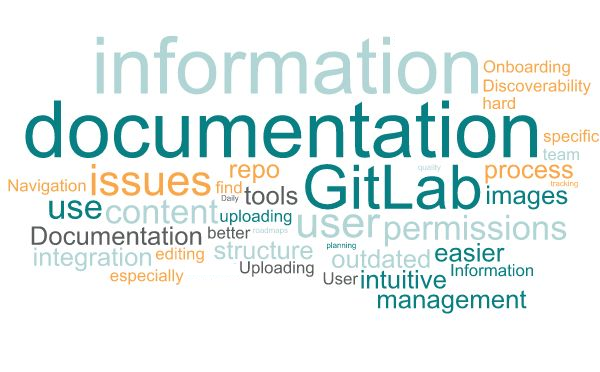
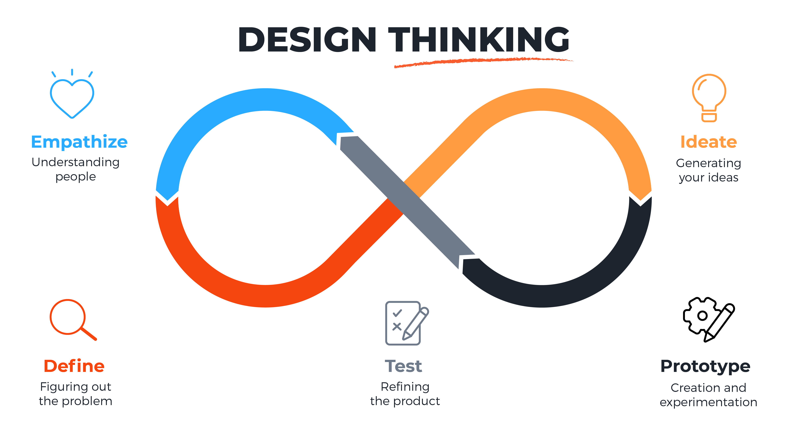

# The Week Before 

So here I am. After 11 years since I graduated from the University of Leicester with a BEng (Hons) in General Engineering, I'm back in the world of being a student. This time doing the User Experience (UX) Design MA at Falmouth University. To say I'm exicted would not be entirely accurate, I'm also quite nervous. It's been so long since I've studied, I don't know how hard this is going to be.

With that said, the main excitement comes from bettering the existing knowledge I already have. I've been adjacent to the world of UX for the better part of a decade, being a Technial Author/Writer. Though my current role involves a lot of UX-style work. I'm always engaging with co-workers, predominately in the Software Dev world, to find out what tooling/pipelines etc. could be used to better their development experience. I am in no way an expert when it comes to this, I'm just able to do a lot of research and take the time to design, develop and deploy tools for testing. If the Devs like it, great. If they don't... well it's back to the metaphorical drawing board for me.

So with that in mind, and given this is going to be a learning diary to cover what is being covered in the module **Development Practice**, I'm going to use this to cover both my education and work lives.

What do I mean by that? Well, I'm going to use it to go over how I'm working on a project at work to stand up a new, internal wiki site. This ties in well with incorporating how I'm using what I'm learning to better this process.

### Why am I Sharing This?

The reality is, the whole project has been slow, tedious and sometimes annoying. I'm hoping that, by sharing this, I'll gain some clarity on what I need to do. I can also look back on it over the coming weeks and see how I could do better, given I'll know more about UX development practices. So I can use my experience of this project as a sort of case study. Because I haven't done anything wrong, I'm getting the job done, I just know I could do better, and I'm curious to see what I'll come up with over the next few months of studying and growing as a person.

> Next up, some background on the existing internal wiki, how I started this project, the feedback I received, and the consequences of said feedback.
>

> Source: [maqe](https://www.maqe.com/insight/the-design-thinking-process-how-does-it-work/)