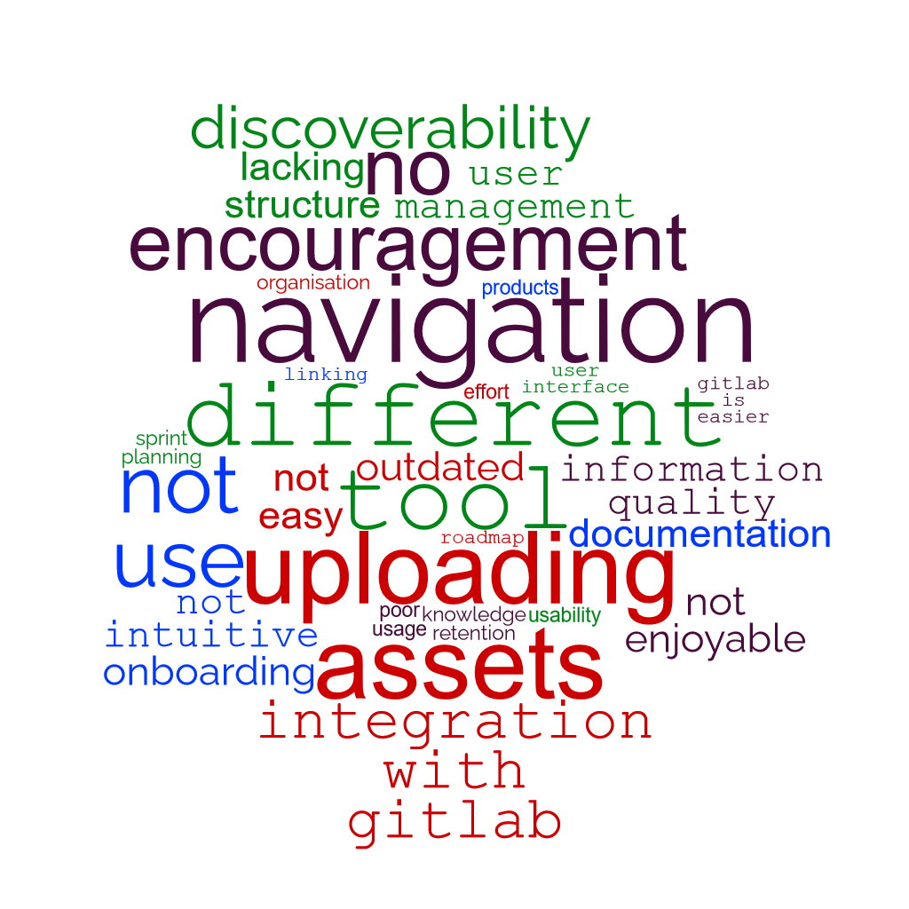

### Where to Start

*"Where to start?"* is usually the hardest question to answer. When it came to the existing wiki, it was fairly easy:

After Step 3. the question *"Can the existing tool be improved to better the UX?"*. Unfortunately for me, the answer was no. With that, let's dive into the current tool in use, the feedback I received and why the answer was **No**.

### Wiki.js, the Feedback and the Consequences

The problems appear when you start looking at the front facing aspects. Or at least the way it has been implemented in the company (and I could go into the political side of things, but lets just say there is a reluctance to change how it's been set up). This is where the feedback comes into play.

One of the most expressed issues with the current wiki set up was the search functionality being poor. Having used the search functionality myself, it is difficult. That was because the company had decided to use the [PostgreSQL](https://docs.requarks.io/search/postgres) search functionality, because the documentation is being stored in a PosgrSQL database. Even the documentation states it's a *"good enough"* search solution. Personally, I think that's over selling how basic that type of search is. It is basic, can only return full matching searches (so partial searches aren't going to happen), and even then, you're lucky to have any results. Another reason it was chosen was because of the company security policy (we have to be self-hosted, no data can be stored on the cloud or managed by a company other than the one I work at). That in itself makes it very restrictive. Because of the security policy, it made the use of Algolia, AWS Cloudsearch, Azure Search and Elasticsearch impossible. Which is annoying, given they're all supported by wiki.js, and have better functionality. 

The second most expressed issue with wiki.js was the created and publishing of documentation. Wiki.js has an inbuilt editor, where you can write documentation. Because the company uses a PostgreSQL database to store the documentation, there is no repository (e.g. Git), where all the documentation is pushed to for publishing. Which is a big problem in the company, as there is a huge push (including from me) to estabish a doc-as-code mentality. Simply put, the documentation lives with the code it's about and can be published to wherever it needs to go. So to get around this problem, another member of the team I'm in created a tool known as *Scribe* to publish any code to the PostgreSQl database from any company repository. All the developers needed to do what make sure that the Scribe tool was inserted into the Git build pipelines, so the necessary metadata could be added.

So one problem solved, right? No. Developers don't use Scribe. Because the company development is fast and ever changing direction, Scribe can become "broken" at any time. Which means more time is spent of retroactively fixing Scribe. No amount of pushing Engineering/Development teams, giving them live and recorded tutorials is getting them to try and use Scribe. They want a tool that can just pull directly from their repositories, and they don't have to do or add anything else into product build pipelines.

That itself is a whole other can of worms. No amount of UX design, research, instructional training or documentation can make people use a tool they've already decided they do not like. And that is the consequence of not doing proper UX and architecture research before development and deployment. Wiki.js was implemented before I was hired, so it's not like I could've prevented any of this from happening.

From one consequence comes another... The consequence of not doing proper research has led to people not using the wiki at all for their documentation. So Scribe was created to help with that, and noone wants to use it because they do not like wiki.js. So here I am, effectively reinventing the wheel, because instead of just tweaking the wiki.js implementation and creating a business case for doing things such as being able to use a better search funtionality, I'm trying to find a new static site generator that will do everything the company needs, and gives a better experience than the one wiki.js has created. 

So now onto my current problem... finding the tool that can do it all.

> The next post will be a deep dive into the research and comments about potential other tools. Like this one, it's going to be a long post.

> Source: [maqe](https://www.maqe.com/insight/the-design-thinking-process-how-does-it-work/)