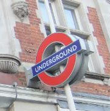
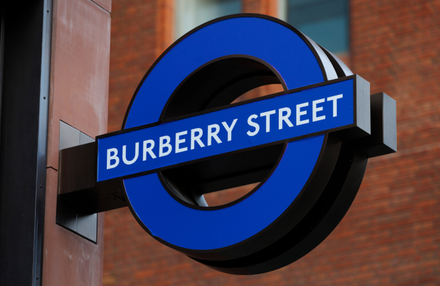
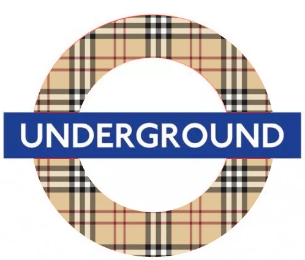

# User Experience and the Physical World

*COMPARE TO HACKNEY DIAMONDS TAKEOVER*

When I first started thinking of user experience (UX), research and design, I had a very narrow view of it being for human-computer interactions. Software, websites and things like that. Then I decided to start looking at the wider world, and came to realise that UX is very much applicable to the physical world.

Being a Londoner (albeit living in the West Country now), I stumbled across an article regarding TfL (Transport for London) temporarily renaming Bond Street to Burberry Street for London Fashion Week 2023. [This is one of the many articles on it](https://secretldn.com/burberry-street-bond-street/). The change happens from 15th September to 19th September.

For any readers not familiar with Bond Street tube station, here's a bit of information about it.

## Bond Street Tube Station

Bond Street Station is a London Underground and Elizbeth Line station in Mayfair. 

There are entrances to the station on Oxford Street, near New Bond Street and Hanover Square. Being on the Central and Jubilee lines, it's an incredibly busy station for shoppers and tourists, and because the Central and Jubilee lines are part of the [Night Tube Service](https://en.wikipedia.org/wiki/Night_Tube), the station is pretty much always open.

> I promise I won't start going into the history of the station, though it has been around since 1900, so it is an old station!

Being in Mayfair, Bond Street is close many exclusive brand stores, designer fashion, luxury goods, art and antiques. As you can imagine, a lot of tourists want to visit Bond Street. 

## How Does the Station Name and UX Go Together?

The title of this section was a question I was asked by my husband when I said I was going to write about this topic. Primarily because he thought UX was a software/human-computer "thing", and not really applicable to the wider world. With that came a discussion where I tried to explain it to him through the eyes of someone not familiar with London and the London Undersground. 

The story I went with is:

*"Imagine you're a tourist, and this is your first trip to London. Since planning this trip, you've wanted to go to the Alexander McQueen Store on Old Bond Street. You're staying at a hotel near Notting Hill Gate tube station, which is on the Central line. You know you can take a train on the Central Line to Bond Street. What you do not know is that for London Fashion Week, TfL has renamed Bond Street to Burberry Street. All of the signs at Bond Street have changed, along with announcements on the trains when you get to the stop. How would it make you feel if you got to Bond Street, only to hear the announcement say "Burberry Street?""*

When trying to explain the narrative, I had to do the following:
- Come up with a narrative that isn't an edge case, and could happen on a regular basis. 
- Get the listener/reader to empathise with the the person in the story.
- Start to think about the impact on the person's experience in the story.

## Accessibilty

Another aspect, one that does tie in to the user experience thought, is that of accessibility. By performing the name change in such a broad manner, TfL run the risk of isolating people who have visual impairments or any sort of hearing loss. 

Those with only visual impairments rely on audio cues, and if the announcements only refer to Bond Street as "Burberry Street", then it's going to create great difficulty for those. 

Those with only hearing loss rely on visual cues, so by changing the name everywhere, TfL has created another isolating scenario. 

As it turns out, there were a few articles on the station name change that contained similar stories to the one mentioned above. So while TfL probably won't reverse the name change during London Fashion week, what can be learned in terms of user experience. For me, it would be the following: 

**Train announcements at or approaching the station**

I wouldn't omit Bond Street from the announcements altogether. There are not many people who have enough knowledge of the London Underground to know where Bond Street sits on the tube lines. I would've, potentially, had an announcement that would have along the lines of "...we are now approaching Bond Street. For London Fashion Week, signs say Burberry Street".

This is entirely feasible, given that longer announcements have been made on trains before. 

**Station Signage**

Given that the typical underground sign looks like the image below, or instead of the text *UNDERGROUND*, it says the station name, e.g. *BOND STREET*, there were other design oppotunities that would not have caused so much confusion.

TfL chose to change the signage to the image below, which does all the marketing etc. they could want, it's not necessarily the best design they could've chosen.

Personally, I would've gone for something like the image below, where the colour of the circle was changed from red to the pattern that is iconic to Burberry fashion.

You wouldn't want the pattern to be behind the *Underground* text, as then you're stepping into accessibilty issues for those who need to read. Even though the red is iconic to the London Underground, this could work by keep the iconic shape associated with tube stations, and you do not need to change the name of the station. This means those not familiar to London would still know they're at Bond Street.

# Conclusion

Given I've covered what the issue is and what I would have done to keep the spirit of the London Fashion Week campaign live, I do belive that TfL's decision to temporarily change the name of Bond Street to Burberry Street is a bad decision when looking at real-world user experience. 

Those not local to London may not have read any news articles about the change, so it would be a confusing change to see. Without any caveats in announcements that mention Bond Street, it further isolates anyone from enjoying their experience on the tube. People could end up confused, agitated, scared or angry at the changes.

London and toursits/those not local to London go hand in hand, as London is an attractiion. My recommendation to TfL would be that if you intend to undertake another campaign like this again, consider the user experience. From a marketing perspective, it may be fun and whimsicle, but that is all lost when the user experience is a negative one. Consider different options, and make sure that you are not isolating any one from the experience.

*Sources*
- [Bond Street sign image](https://www.visitlondon.com/traveller-information/place/284187-bond-street-underground-station)
- [Burberry Street sign image](https://secretldn.com/burberry-street-bond-street/)
  
