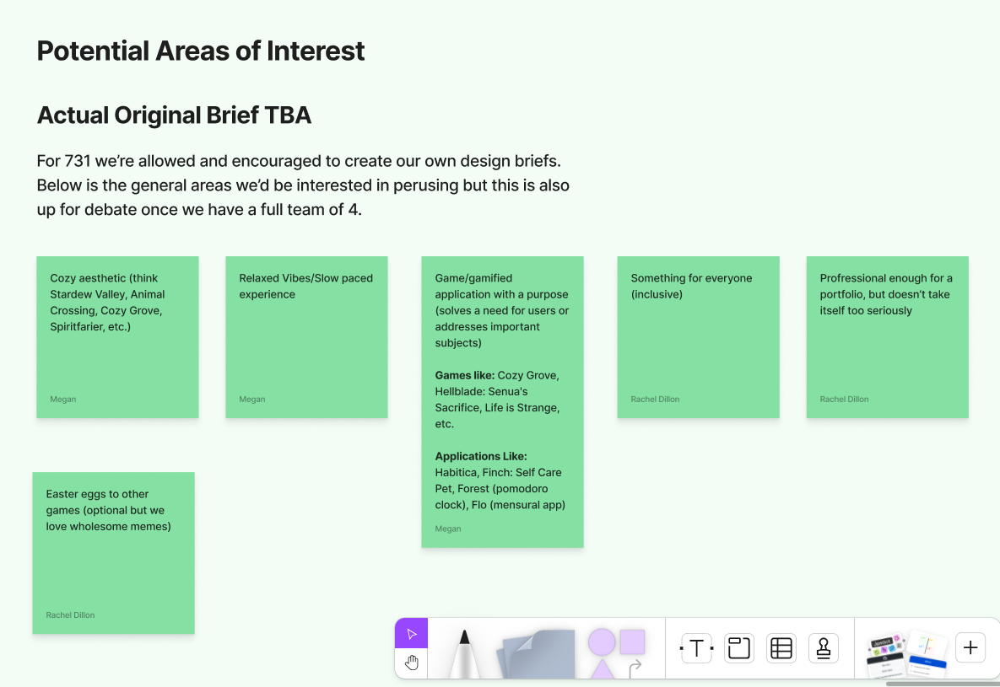

# Design Brief

As a reminder here is a screenshot of what was original written in the 730 figma

## Current Idea

Point-and-click corporate hell game, in literal hell. 

## Audience/Market Research

abc

## Value

- what are we achieving
- 

--- 
# Brainstorming Assessment

# Pitch Presentation

## Why this idea ?

Corporate hell : unsatisfied employees, need to put things into perspective, have fun, join a community ? Feel less alone when face with the disappointment of corporate ?

A personal story or anecdote from one of us could be good, isn’t it ?

## Why our team ?

- Complementary skills, just overlapping enough
- Trust among groups members
- Non-judgmental, open-minded, well-inteded

# Product Execution

## What have we achieved ?

- Learn to work in a team, and collaborate (see Figjam, Discord chat, Notion)
- Be reasonable and honest about our resources and manage our expectations (as individuals and as a team)
- Be confident in each other's ability
- Respect boundaries